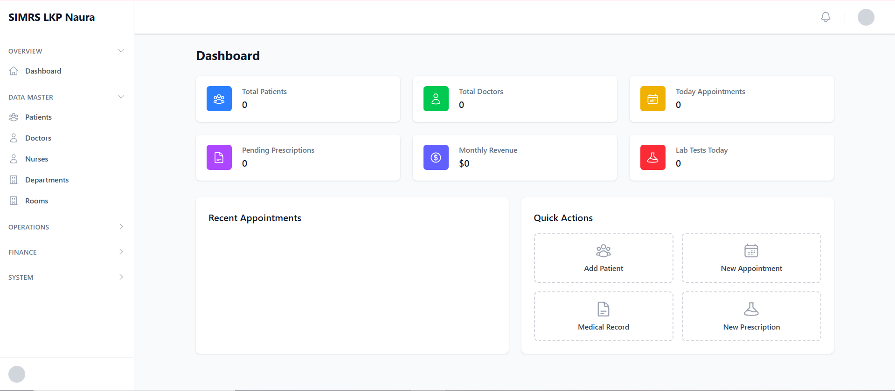

<p align="center"><a href="https://laravel.com" target="_blank"></a></p>

<p align="center">
<a href="https://github.com/laravel/framework/actions"></a>
<a href="https://packagist.org/packages/laravel/framework"></a>
<a href="https://packagist.org/packages/laravel/framework"></a>
<a href="https://packagist.org/packages/laravel/framework"></a>
</p>

## SIMRS – Sistem Informasi Manajemen Rumah Sakit
### Screenshot Aplikasi

Berikut adalah tampilan aplikasi SIMRS:

<p align="center">
  
</p>

<p align="center">
  
</p>

SIMRS ini dibangun oleh LKP Naura, dikembangkan oleh salah satu instruktur: Neprianto.

Aplikasi menggunakan Laravel + Inertia.js + React untuk menyediakan pengalaman SPA dengan kemudahan routing Laravel. Proyek ini ditujukan sebagai pondasi sistem manajemen rumah sakit modern yang mudah dikembangkan.

### Fitur Utama
- Manajemen pasien (CRUD) dengan form validasi dan pagination
- Dashboard ringkas (statistik pasien, dokter, janji temu, pendapatan, dsb.)
- Modul laboratorium: Lab Tests dan Lab Results (CRUD, listing, detail)
- Navigasi yang dikelompokkan (Overview, Data Master, Operations, Finance, System)
- Komponen UI reusable: DataTable, FlashMessage, layout terautentikasi
- Integrasi Ziggy untuk bantuan `route()` di sisi frontend

### Teknologi
- Backend: Laravel 11
- Frontend: React (Inertia.js)
- Build tool: Vite
- Database: SQLite secara default (mudah diganti MySQL/PostgreSQL)
- UI: Tailwind CSS + Heroicons

### Persyaratan
- PHP 8.2+
- Composer 2+
- Node.js 18+
- NPM 9+ (atau PNPM/Yarn sesuai preferensi)

### Instalasi (Windows/Laragon ataupun umum)
1) Clone repo ini
2) Instal dependensi PHP
```
composer install
```
3) Instal dependensi Node
```
npm install
```
4) Salin env dan generate key
```
cp .env.example .env
php artisan key:generate
```
5) Konfigurasi database di `.env` (default sudah menggunakan `database/database.sqlite`). Untuk SQLite:
```
type nul > database\database.sqlite
```
6) Migrasi dan seeder (opsional)
```
php artisan migrate --seed
```
7) Build aset (production) atau jalankan dev server
```
# Development
npm run dev

# Production build
npm run build
```
8) Jalankan server aplikasi
```
php artisan serve
```

### Rute Penting (Web)
- `/dashboard` – Dashboard
- `/patients` – CRUD Pasien
- `/lab-results` – CRUD Hasil Lab

API endpoints tersedia di `routes/api.php` untuk sumber daya lain (users, doctors, nurses, dll.).

### Struktur Proyek Singkat
- `app/Http/Controllers` – Controller Laravel (mis. `PatientController`, `LabResultController`)
- `app/Models` – Model Eloquent (mis. `Patient`, `LabResult`)
- `database/migrations` – Struktur skema database
- `resources/js` – Kode frontend React (Layouts, Pages, Components)
- `resources/views/app.blade.php` – Layout Blade utama untuk Inertia
- `routes/web.php` – Rute web (Inertia)

### Integrasi Inertia + React
- Entry: `resources/js/app.jsx`
- Halaman: `resources/js/Pages` (mis. `Patients/Index.jsx`, `LabResults/Index.jsx`)
- Layout utama: `resources/js/Layouts/AuthenticatedLayout.jsx`

### Ziggy (route helper di frontend)
Proyek memakai Ziggy agar `route()` bisa digunakan di React.
- Server: `@routes` sudah ditambahkan di `resources/views/app.blade.php`
- Client: paket `ziggy-js` terpasang dan diekspor melalui `resources/js/app.jsx`
- File rute: `resources/js/ziggyRoutes.js` (hasil `php artisan ziggy:generate`)

Contoh penggunaan di React:
```jsx
import { route } from 'ziggy-js'
import { Ziggy } from '@/ziggyRoutes'

const url = route('patients.show', { patient: 1 }, false, Ziggy)
```

### Pengembangan
- Linting/formatting mengikuti konvensi proyek (JSX, PHP)
- Komponen UI terstruktur agar mudah diperluas
- Ikuti pola pada modul Patients untuk menambah modul baru (Controller + Routes + Pages)

### Kredit
- LKP Naura – Pemilik proyek
- Neprianto – Developer/Instruktur

### Lisensi
Proyek ini ditujukan untuk kebutuhan pembelajaran dan internal LKP Naura. Untuk penggunaan komersial, silakan koordinasi dengan pihak LKP Naura.
